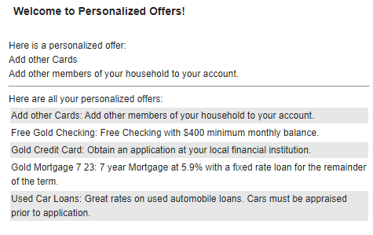

# HCL Digital Experience Personalization development sample (Pers_Offers)

This sample project is to help developers using the [Personalization API](https://opensource.hcltechsw.com/digital-experience/latest/manage_content/pzn/pzn_programming_ref/using_apis/?h=com.ibm.websphere.personalization) to fully personalize the experience of your users with a personalization portlet.  

This portlet works with four different users (scott, andy, marge and tawana) and a pre-configured backend database (pzndemo_db). The sample uses a JSP Portlet to show up personalized offers from a database to a specific user that is currently logged in into the HCL Digital Experience server.

A personalization portlet is a portlet that can show up specific information to a user based on rules. For details, please check: [Personalization](https://opensource.hcltechsw.com/digital-experience/latest/get_started/product_overview/personalization/?h=personalization)

## Sample screenshot of the Pers Offers Portlet, when logged in as user Scott  

  

This project is an extension of the [Personalization Demo](https://opensource.hcltechsw.com/digital-experience/latest/manage_content/pzn/pzn_portlet/index.html).
There are some prerequises needed to let the portlet run correctly. Detailed installation instructions can be found below.  

## Prerequisites

- Maven need to be installed
- Microsoft Visual Studio Code
- git or git-bash
- HCL Digital Experience need to be installed locally or remotely. A single server instance is enough.
- dxclient should be installed, if the pre-configured deployment/undeployment task will be used

This sample provides a Maven project, which is ready to use in Microsoft Visual Studio Code. Configuration introductions to setup your HCL DX Java Development environment can be found at [HDX-DEV-300 HCL Digital Experience for Developers (Advanced) - Introduction lesson](https://hclsoftwareu.hcltechsw.com/component/axs/?view=sso_config&id=3&forward=https%3A%2F%2Fhclsoftwareu.hcltechsw.com%2Fcourses%2Flesson%2F%3Fid%3D1777)

**Please notice:**  
This sample project is created on a Microsoft Windows environment on which the pzndemo_db default location is configured to be on directory:  
**PZN-Database default location:** C:\HCL\wp_profile\PortalServer\derby\pzndemo_db  
Code changes in the [hrf-files](./Pers_Offers/pers_offers/rules/) might be needed when the pzndemo_db will be installed on a different location.

## Installation

1. Clone this repository to your development environment

2. Import the rules located in [hrf-files](./Pers_Offers/pers_offers/rules/) into your Digital Experience server. Use the following steps to import the rules:

    1. Extract the **Portal_rules_PznOffers.zip** file located in the rules directory to any folder.
    2. Login to the Portal Administration page as potal admin user.
    3. Navigate to **Personalization** > **Business Rules**
    4. Click to **New** > **folder** to create a new folder with name **Pers Offers**.
    5. Click the **Import** button and import the following rules into the **Pers Offers** folder.

        1. Per_Offers_User.nodes
        2. Pzn_offers.nodes
        3. Show+Gold+Offers.nodes
        4. Show+Platinum+Offers.nodes
        5. Show+Titanium+Offers.nodes
        6. Show+Offers+by+Customer+Type.nodes
        7. Pers+Offers+User+Profiler.nodes

    6. Click the **Import** button and select the following rule to be imported into the **main (workspace)** folder.

        1. Pzn_offers+spot.nodes

3. Run the following two ConfigEngine tasks on the HCL Digital Experience server to create the personalization demo users and the backend database with additonal resources like demo pages that will be used for this personalization.

    **UNIX™Linux™:**  
    ```./ConfigEngine.sh create-pzndemo-users -DPortalAdminPwd=<password> -DWasPassword=<password>```  
    ```./ConfigEngine.sh install-pzndemo -DPortalAdminPwd=<password> -DWasPassword=<password>```  

    **Microsoft Windows™:**  
    ```ConfigEngine.bat create-pzndemo-users -DPortalAdminPwd=<password> -DWasPassword=<password>```  
    ```ConfigEngine.bat install-pzndemo -DPortalAdminPwd=<password> -DWasPassword=<password>```  

    These two tasks generate the demo-users and the pzndemo_db database that is used in this sample Portlet.. For details, please check:

    <a href="https://opensource.hcltechsw.com/digital-experience/latest/manage_content/pzn/pzn_portlet" target="_blank">Develop a Personalization Portlet</a>  
    <a href="https://opensource.hcltechsw.com/digital-experience/latest/manage_content/pzn/pzn_portlet/pzn_demoinstall/" target="_blank">Install the Personalization sample</a>

4. Open the folder **\DX-Personalization-Development-Sample\Pers_Offers\pers_offers** in your Microsoft Visual Studio code.

5. Compile and package the portlet using the Maven Lifecycle in Microsoft Visual Studio or by using the command line. The Maven package command helps to create the Portlet war file that by default will be located in the target directory of this project.  

6. Deploy the portlet on a HCL Digital Experience environment using the dxclient (see tasks.json file) or by manually installing the WAR file.

## Additional Information

Detailed steps to create such a personalization Portlet can also be found on the HCL Digital Experience Help Center page [Develop a Personalization Portlet](https://opensource.hcltechsw.com/digital-experience/latest/manage_content/pzn/pzn_portlet)  
